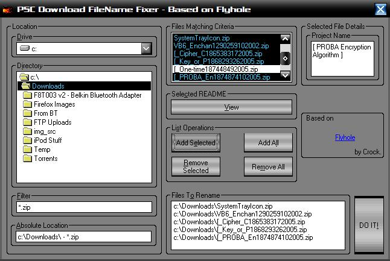

<div align="center">

## PSC Download Renamer 1\.3


</div>

### Description

You know how when you download a ZIP file from PSC, the file name becomes a tangled mess such as "[_Cipher_C1865383172005.zip"?

This program will let you browse for the folder with your downloaded ZIP files and will rename the ones you select based on the Project Title included in the first line of the PSC_README.... file. It will also display the contents of that readme file without extracting it to disk.

----

UPDATE 7/17/2005: removed debug code that prevented compilation

----

UPDATE 7/17/2550 4:35 PM: required dll's added in the second zip file. Unzip and register. Also, included the manifest file as a resource (for WinXP Visual Styles compatibility, source is in the Res folder). Thanks to Aly Hirani for pointing out that this project requires a non-standard DLL.

----

UPDATE 7/18/2005 10:43 AM : Removed some spaghetti code as suggested by Roger Gilchrist and modified renaming code to remove the Read Only attribute from each file to be renamed. Still thinking about how to implement the part of checking to see that the destination file does not exist and how to deal with that. I also removed all but the latest code backup in order to reduce the size of the download.

----

Anybody know how to properly add new lines on the description field?

----

UPDATE 7/19/2005 12:38 PM: Implemented both Aly's Suggestions. 1) Unzip32.dll is included in the resource file and will be extracted if it does not already exist (if for some reason you want to alter my resource file and PSC deleted the original unzip32.dll in the Res folder, the DLL file is located on the zip file in that folder) and 2) if a ZIP file contain no @PSC_README*.txt, the project name textbox will state that no readme file was found and if the user tries to rename that file, the program will not allow it (skips over it and at the end states why for all skipped files).
 
### More Info
 
Pretty intuitive interface. Even a beginner should have no problem using it.

The renaming logic does not check for files that already exist. I am working on that. Expect a fix soon.


<span>             |<span>
---                |---
**Submitted On**   |2005-07-19 12:36:02
**By**             |[Ariel D\. Poliak](https://github.com/Planet-Source-Code/PSCIndex/blob/master/ByAuthor/ariel-d-poliak.md)
**Level**          |Advanced
**User Rating**    |5.0 (10 globes from 2 users)
**Compatibility**  |VB 6\.0
**Category**       |[Files/ File Controls/ Input/ Output](https://github.com/Planet-Source-Code/PSCIndex/blob/master/ByCategory/files-file-controls-input-output__1-3.md)
**World**          |[Visual Basic](https://github.com/Planet-Source-Code/PSCIndex/blob/master/ByWorld/visual-basic.md)
**Archive File**   |[PSC\_Downlo1915087192005\.zip](https://github.com/Planet-Source-Code/ariel-d-poliak-psc-download-renamer-1-3__1-61727/archive/master.zip)

### API Declarations

```
Private Enum ShowWindowType
 SW_HIDE = 0
 SW_NORMAL = 1
 SW_MINIMIZED = 2
 SW_MAXIMIZED = 3
End Enum
#If False Then 'Trick preserves Case of Enums when typing in IDE
Private SW_HIDE, SW_NORMAL, SW_MINIMIZED, SW_MAXIMIZED
#End If
Private ZipName As String
Private FilePath As String
Private ProgName As String
Private Declare Sub InitCommonControls Lib "comctl32" ()
Private Declare Function ShellExecute Lib "shell32.dll" Alias "ShellExecuteA" (ByVal hwnd As Long, ByVal lpOperation As String, ByVal lpFile As String, ByVal lpParameters As String, ByVal lpDirectory As String, ByVal nShowCmd As ShowWindowType) As Long
```


